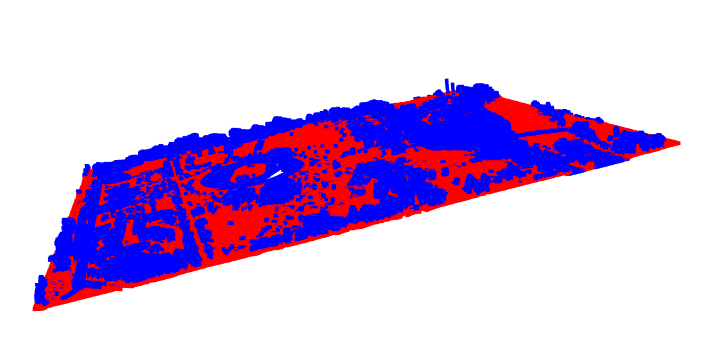
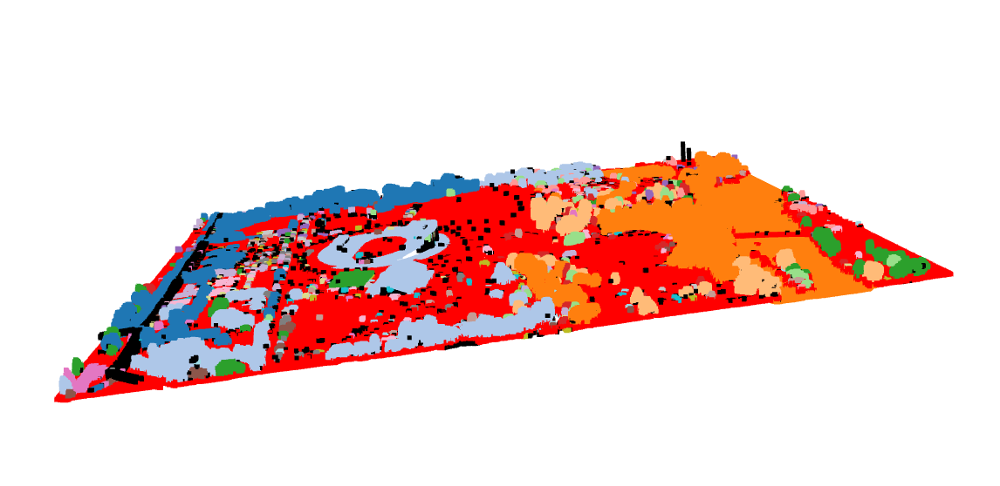
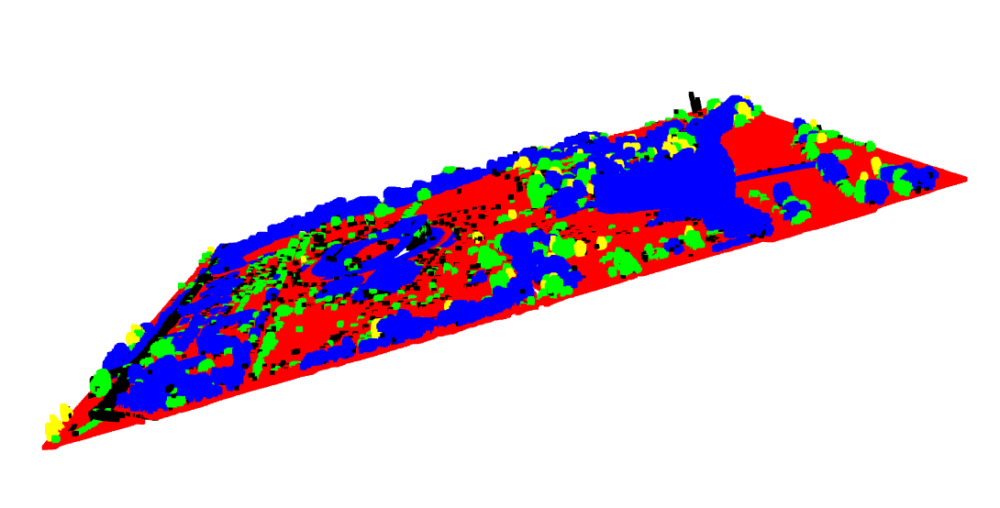

# LiDAR Point-Cloud Processing Pipeline

A from-the-ground-up perception pipeline that turns a raw aerial LiDAR scan into a
segmented, clustered and classified scene. It isolates the ground, separates
above-ground objects, and labels each cluster as **pole-like**, **building-like** or
**vegetation-like** using geometric features.

Built with Python + [Open3D](http://www.open3d.org/), tested on the real-world
**Autzen Stadium** aerial scan (~10.6M points, `.laz`).

## Example Output

| Ground segmentation (RANSAC) | Clustering (DBSCAN) | Classification (PCA rules) |
|---|---|---|
|  |  |  |

*Red = ground, coloured blobs = individual objects, and in the final image
yellow = poles, blue = buildings, green = vegetation.*

## Pipeline

| Stage | Method | Purpose |
|-------|--------|---------|
| **Load** | `laspy` → NumPy → Open3D | Read the `.laz` scan into an `(N, 3)` point array |
| **Downsample** | Voxel grid | Reduce ~10.6M points to a workable ~1.4M |
| **Denoise** | Statistical outlier removal | Drop isolated noise points |
| **Ground segmentation** | RANSAC plane fitting | Split terrain from above-ground objects |
| **Clustering** | DBSCAN | Separate above-ground points into discrete objects |
| **Classification** | PCA geometric features + rules | Label each object pole / building / vegetation |

### Classification features

For every cluster, PCA is run on its points to obtain the three eigenvalues
(λ0 ≥ λ1 ≥ λ2) of the covariance matrix, which describe the local shape:

- **linearity** `(λ0−λ1)/λ0` — high for line-like structures (poles, wires)
- **planarity** `(λ1−λ2)/λ0` — high for flat surfaces (walls, roofs)
- **sphericity** `λ2/λ0` — high for scattered volumes (foliage)
- **verticality** — vertical component of the dominant eigenvector

Combined with cluster **height** and **footprint**, simple rules assign the label.
The key insight: *linearity alone does not imply a pole* — a horizontal structure is
also linear — so **verticality** is the true discriminator between a vertical mast and
a flat, elongated object.

## How to Run

```bash
# 1. Environment (Python 3.11/3.12 — Open3D has no wheels for 3.13+)
python3 -m venv .venv
source .venv/bin/activate
pip install open3d laspy lazrs numpy matplotlib

# 2. Place a .laz scan in data/  (e.g. Autzen: data/autzen.laz)

# 3. Run the full pipeline
python src/classified_objects.py
```

The labelled cloud is written to `output/autzen_classified.ply`.

## Methods

- **Voxel downsampling** — partition space into cubes, keep one point per cube.
- **RANSAC** — randomly sample 3 points → fit a plane → count inliers → keep the best;
  the dominant plane is the ground.
- **DBSCAN** — density-based clustering; finds an arbitrary number of arbitrarily
  shaped objects and flags noise, unlike k-means.
- **PCA** — eigen-decomposition of each cluster's covariance matrix to read its shape.

## Limitations

- **Single-plane RANSAC** cannot follow undulating terrain; `distance_threshold` is a
  trade-off between capturing sloped ground and absorbing low objects. It is tuned here
  to keep tall structures separated at the cost of removing very low objects.
- **Rule-based classification** is coarse. `vegetation` acts as the catch-all class, so
  it over-counts, and some vertical tree trunks may be misclassified as poles.
- RANSAC is stochastic, so cluster/label counts vary slightly between runs.

## Roadmap / Stretch

- [ ] RANSAC plane fitting implemented from scratch (no `segment_plane`)
- [ ] C++ port of the RANSAC hot loop + benchmark vs. the Python baseline
- [ ] Power-line detection (tall + thin + high-linearity + horizontal clusters)
- [ ] Accuracy evaluation against a labelled dataset (e.g. DALES)

## Data

Autzen Stadium classified point cloud, from the public
[PDAL data repository](https://github.com/PDAL/data).
